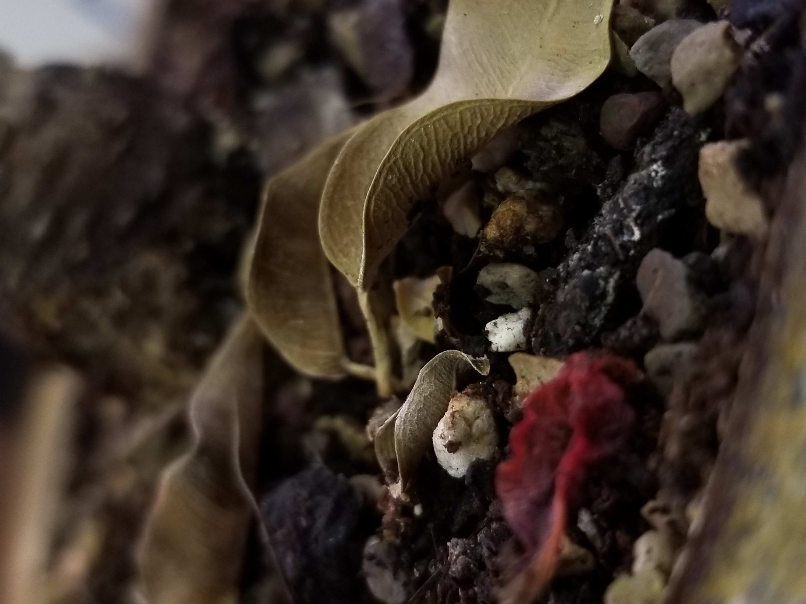

.jpg)


# Ficus Diversity

All ficus belong to a the extremely diverse group of Moraceae. Its member species are utilized for their fruit as well as for ease of indoor cultivation (I personally keep 6 species for their aesthetic value). With over 800 species in the genus, Ficus species come in all kind of shapes and sizes. One trait that is relatively unique to ficus is the growth pattern of strangling another tree. Some ficus start their lives, deposited in the canopy of another tree by bird droppings, as epiphites. In the humid environment of the tropics, the plant is able to put out roots that reach from the canopy to the ground. After reaching the ground, they thicken, and over a period of years engulf the tree that was once its home. It can even kill the tree as it surrounds it in a prison of growing roots. 

{#id .class width=50% height=50%}

## Project Goals

The purpose of this project is to gain insight into the the strangling habit of the ficus genus by taking a look at genetic as well as geographic data. 

```{r,echo=FALSE,message=FALSE}
library(tidyverse)
library(phangorn)
library(ape)
library(seqinr)
library(beepr)
library(msa)
library(ShortRead)
library(phytools)
library(ggtree)
library(purrr)
library(broom)
library(ggrepel)
```
```{r,echo=FALSE,message=FALSE,comment=FALSE}
df <- readDNAStringSet("./seq_match_ficus_metadata.fas", format="fasta",
                 nrec=-1L, skip=0L, seek.first.rec=FALSE, use.names=TRUE)
#align sequences
#alignment <- msaClustalOmega(inputSeqs = df,gapOpening = 400,gapExtension = 1,maxiters = 20, type = "dna")
#save alignment to file for use in markdown
alignment <- readRDS("./output/alignment")
#add metadata
meta <- read_csv(file = "./ficus_metadata.csv")
##change names in alignment ####
alignment@unmasked@ranges@NAMES <- 
  paste(alignment@unmasked@ranges@NAMES %>% str_split(pattern = " ") %>% map_chr(2),
        alignment@unmasked@ranges@NAMES %>% str_split(pattern = " ") %>% map_chr(3),
        sep = "_")
#write the alignment to a phyDat file
df_phydat <- as.phyDat(x = alignment)
phydat <- read.phyDat( "./alignedficus.dna",format = "fasta")


#build distance alignment
dm  <- dist.ml(phydat)


#create some trees
treeUPGMA  <- upgma(dm)
treeNJ  <- NJ(dm)


mt <- readRDS("./output/modeltest_object")
fit <- pml(treeNJ, phydat)
fitHKY <- readRDS("./output/fitHKY")
bootstrap <- readRDS(file = "./output/bootstrap_object")
bootstraptr <- plotBS(tree = treeNJ,BStrees = bootstrap,p = 100)
rr.castilla <- root(bootstraptr,node = 68)

```

## The Data

I started with around 120 sequences of various ficus species from  which I narrowed down to 44 based on availability of the metadata. At this point, lets get it aligned and visualized.


## Alignment

The sequences were aligned using clustal with a gap opening penalty of 400 and a gap extension penalty of 1 taking the best score of 20 iterations. 

Lets do some visualization of this alignment:

{#id .class width=100% height=100%}
With a quick look at the above data, it is clear that there are 6 sequences that overlap very little with the rest of the data. Additionally, there are two sequences that have no detected overlap. I will remove these sequences and test the relationships again. 

{#id .class width=100% height=100%}

Much better.

## Selecting a Tree
Here are the parsimony scores for UPGMA and neighbor joining trees in that order.
```{r echo=TRUE, message=FALSE, comment=FALSE, r,echo=FALSE}
parsimony(treeUPGMA, phydat)
parsimony(treeNJ, phydat)
```
Looks like neighbor joining is ever so slightly more parsimonious compared to UPGMA. 

## Final Adjustments:

#### Rooting
+The tree is rooted to Castilla elastica as it is a closely related outgroup.


## The Tree of trees(and small shrubs)

```{r echo=FALSE, message=FALSE, warning=FALSE}
p1 <- ggtree(rr.castilla,branch.length = "none",nodelabels=T,)
p1 %<+% meta + geom_tippoint(aes(color = Strangler))+ 
  geom_tiplab(aes(fill =Location),
              size = 2,
              offset = .5,
              color = "black", # color for label font
              geom = "label",  # labels not text
              label.padding = unit(0.15, "lines"), # amount of padding around the labels
              label.size = 0) +
  labs(title = "Ficus Phylogeny",subtitle = "Tippoints colored by strangler habit. Labels colored by geographic location")+# size of label border
  theme_tree()+coord_cartesian() # no keys
```

## Conclusions

There are a few factors to consider when looking at this graph. Ficus species are peculiar in their general mode of pollination. As a general rule they cannot be pollinated by just any insect. Most species of ficus have coevolved with minuscule fig wasps that pollinate their figs. This would restrict the spread of ficus species to inside the range of their pollinators. The age of the genus(sometime in the Cretaceous period) may also play a role as it is quite old and the extinction rate is low. This supports the museum model of diversity which I believe might support several origins of the strangling habit. 
Looking at the generated phylogeny, it seems clear that within this dataset, there are three distinct group of stranger figs. Starting at the top, of the tree, there is a group from India, followed by a group from Southeast Asia, and finally a less neatly defined group from the Americas(Central and North) and Australia. While Southeast Asia and India are relatively nearby, the phylogenetic tree does reinforce the the three way divide. It would appear that the strangling habit has evolved three distinct times.


## Future Work

If I was to revisit this project, the two main things that I would want to improve upon would making the phylogeny a multigene phylogeny and to increase the sample size. with only the rbcl gene to go off of, there is a lot of uncertainty in the phylogenetic trees produced. Getting the bootstrap values lower would be ideal. Increasing the sample size would also provide more evidence for( or against), the patterns I found in the resulting phylogeny.


---------


## References:

Bruun-Lund, Sam, Brecht Verstraete, Finn Kjellberg, and Nina Rønsted. 2018. “Rush Hour at the Museum – Diversification Patterns Provide New Clues for the Success of Figs (Ficus L., Moraceae).” Acta Oecologica 90: 4–11.
Drude Molbo et al. 2003. “Cryptic Species of Fig-Pollinating Wasps: Implications for the Evolution of the Fig-Wasp Mutualism, Sex Allocation, and Precision of Adaptation.” Proceedings of the National Academy of Sciences of the United States of America 100(10): 5867.
“Ficus | Description, Pollination, & Major Species.” Encyclopedia Britannica. https://www.britannica.com/plant/Ficus (April 18, 2020).
Information, National Center for Biotechnology, U. S. National Library of Medicine 8600 Rockville Pike, Bethesda MD, and 20894 Usa. “National Center for Biotechnology Information.” https://www.ncbi.nlm.nih.gov/ (April 25, 2020).


